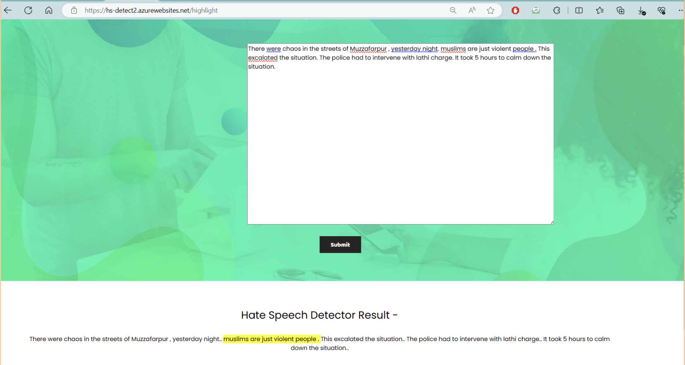

# Hate-Speech-Detection

## Setup Instructions

1. **Create a virtual environment**
    ```bash
    python -m venv venv
    source venv/bin/activate
    ```

2. **Install required packages**
    ```bash
    pip install -r requirements.txt
    ```

3. **Run the Flask app**
    ```bash
    python app.py
    ```

## Demo


